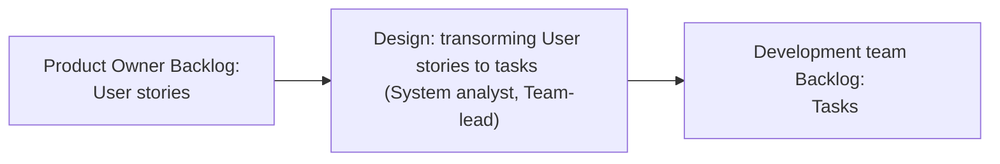

# Разработка Enterprise-приложений

> ### "Quod est rigens et durum, frangitur. Quod est flexibile et cedens, vincit." - Lao Tzu
> _То, что жесткое и твердое, ломается. То, что гибкое и податливое, преодолевает. - Лао-Цзы_

Вторая часть портфолио: Репозиторий для фиксации артефактов знаний с курса [Разработка Enterprise-приложений без боли и сожалений](https://howto.stringconcat.com/enterprise) и проекта курса.  
Первая часть портфолио: [Система управления складом (WMS) (backend NodeJS/TS)](https://github.com/PortnovAlex80/node_js_pro#readme)" является подводкой к принципам **GRASP** (pattern of assigning responsibilities) & **GoF** (Gang-of-Four).  
https://gitlab.com/groups/string-concat-enterprise   

⚠️**Репозиторий в работе на начальной стадии. Плановый срок завершения - 09\2023** ⚠️  

Содержание:  
[Блок 1. Разработка и управление требованиями](#блок-разработка-и-управление-требованиями)
- [Введение](#введение)
- [Принципы формирования беклога](#принципы-формирования-беклога)
- [Флоу работы с требованиями на проекте](#флоу-работы-с-требованиями-на-проекте)
- [Интервью с Заказчиком](#интервью-с-заказчиком)
- [Разработка User Story Map](#user-story-map)
- [Разработка для некоторых User story Use cases](#use-cases-for-user-story)  
   

[Блок 2. Инфраструктура проекта](#блок-инфраструктура-проекта)

📝 - пометки
🔗 - ссылки
📖 - описание
☑️ - чек листы

## Блок Разработка и управление требованиями

### Введение
В проекте использовуется подход к разработке требований через Пользовательские истории.  
Пользовательские истории относятся к пользовательским требованиям. И являются входными данными для этапа проектирования.  
Результатом блока является User Story mapping, User story, Job story, Use cases (системные).   
Основная литература:  
Майк Кон: Пользовательские истории. Гибкая разработка программного обеспечения  
Джефф Паттон. Пользовательские истории. Искусство гибкой разработки ПО

>_Однако стоит учесть, что критерии приемки в карточке User story относятся уже к функциональным требованиям. И в сложных пользовательских историях может понадобится применение use cases сценариев (например, чтобы понять как работают несколько пользовательских историй вместе)_

⚠️ Считаю важным ознакомится со следующими двумя заметками:

 📖 Концепция User Story 

Концепция User story включает три аспекта:
1. **Текстовое описание (Written Description)**: User story начинается с текстового описания, которое включает в себя короткую, но информативную формулировку требования. Оно должно быть простым, понятным и конкретным, чтобы все заинтересованные стороны могли легко понять его суть.

2. **Устное обсуждение (Verbal Discussion)**: User story не ограничивается только текстовым описанием. Оно служит основой для устного обсуждения между разработчиками, заказчиками и другими заинтересованными сторонами. В ходе обсуждения дополняются детали, задаются вопросы и уточняются требования, чтобы все участники были на одной волне.

3. **Критерии приемки (Acceptance Criteria)**: Критерии приемки определяют условия, которые должны быть выполнены, чтобы считать User story завершенной и приемлемой. Это конкретные и измеримые условия, которые определяют ожидаемое поведение или функциональность. Критерии приемки помогают уточнить ожидания и обеспечить однозначность в определении готовности работы.

Вместе эти три аспекта - текстовое описание, устное обсуждение и критерии приемки - образуют основу User story и способствуют пониманию требований и достижению общего согласия между разработчиками и заинтересованными сторонами.

**Каковы преимущества устного обсуждения требований по сравнению с их определением в виде формальной документации?**
Письменная документация заставляет невольно предполагать исчерпывающую точность описания, чего в действительности может и не быть. Пользовательские истории, в которых карточки служат напоминаниями о том, что еще подлежит дальнейшему обсуждению, позволяют избежать создания ложной видимости того, что все определено очень точно. Одна лишь запись требований еще не является гарантией того, что заказчики получат то, чего они хотят; в лучшем случае они получат то, что записано. Частые обсуждения, особенно те, которые проводятся непосредственно перед разработкой обсуждаемой возможности или даже в процессе самой разработки, обеспечивают лучшее понимание предмета обсуждения и углубляют взаимопонимание между разработчиками и заказчиками.

Ниже приведены примеры.

| Наименование | Описание | Пример |
|--------------|----------|--------|
| Текстовое описание | Краткое описание требования или функциональности | `## Загрузка фотографий` |
| Устное обсуждение | Обсуждение требования между участниками | `- Разработчик: Какие форматы изображений поддерживаются?` |
| Критерии приемки | Условия для завершения User story | `- Изображение успешно загружается и отображается в галерее` |

| Наименование | Текстовое описание | Устное обсуждение | Критерии приемки |
|--------------|--------------------|------------------|------------------|
| Поиск товаров | Как покупатель, я хочу иметь возможность искать мебельные товары по категориям или ключевым словам, чтобы быстро найти нужный предмет мебели. | - Разработчик: Какие категории будут доступны для поиска?   - Заказчик: Можно ли искать товары по ценовому диапазону? | - Возможность поиска по категориям и ключевым словам работает корректно.   - Найденные товары соответствуют указанным категориям и ключевым словам. |
| Детальная информация о товаре | Как покупатель, я хочу видеть подробную информацию о каждом товаре, включая описание, характеристики, цену и наличие на складе, чтобы принять информированное решение о покупке. | - Разработчик: Какие характеристики должны быть доступны для каждого товара?   - Заказчик: Можно ли отображать скидки или акции для товаров? | - Подробная информация о товаре включает описание, характеристики, цену и наличие на складе.   - Скидки и акции отображаются для соответствующих товаров. |
| Добавление товаров в список желаний | Как покупатель, я хочу иметь возможность добавлять товары в список желаний, чтобы отложить покупку и вернуться к ней позже. | - Разработчик: Как пользователь будет иметь доступ к своему списку желаний?   - Заказчик: Можно ли добавлять комментарии или заметки к товарам в списке желаний? | - Товары успешно добавляются в список желаний пользователя.   - Пользователь может просматривать свой список желаний и редактировать его. |

 📖 Предисловие Марти Когана 
  
  
Фрагмент из книги "Пользовательские истории. Искусство гибкой разработки". Джефф Паттон  
  
Мне невероятно повезло – я имел возможность работать с представителями лучших в мире компаний и групп разработки разных технологий. Эти люди создают программы, которые вы любите и которыми пользуетесь каждый день. Люди, которые буквально меняют мир.  

Кроме этого, мне часто приходилось помогать компаниям, у которых дела идут не так здорово. Это были стартапы, пытающиеся запустить хоть что-то работающее, прежде чем кончатся деньги. Компании покрупнее, выбивающиеся из сил в попытке воплотить в жизнь свои последние разработки. Команды, безуспешно пытающиеся повысить эффективность бизнеса. Лидеры, раздраженные тем, как много времени занимает переход от идеи к воплощению. Инженеры, конфликтующие с владельцами своих продуктов.  

Из этого всего я вынес в первую очередь понимание того, насколько по-разному создают технологические продукты самые популярные компании на рынке и все остальные. И я не говорю сейчас о каких-то мелких различиях. Я имею в виду решительно все: подход руководителей к делегированию полномочий командам, способ взаимодействия команд, отношение организации к финансированию, комплектованию штата и выпуску продуктов, культуру, а также то, каким образом объединяют продукт, дизайн и технологии, чтобы разрабатывать самые эффективные решения для клиентов.  

Эта книга называется «Пользовательские истории. Искусство гибкой разработки ПО», но очень скоро вы заметите, что она повествует о чем-то большем, чем такая простая, но мощная техника, как построение пользовательских карт историй. С помощью книги можно проникнуть в самую суть того, как команды сотрудничают, общаются и в конце концов приходят к созданию великолепных продуктов.  

У многих из вас никогда не было возможности с близкого расстояния наблюдать за сильной командой в процессе работы над проектом. Возможно, опыт работы в компаниях, где вы трудились раньше или трудитесь сейчас, – все, что у вас есть. Поэтому я попытаюсь рассказать о том, насколько самые лучшие команды отличаются от всех остальных.  

С благодарностью в адрес Бена Хоровица и его книги «Хороший менеджер продукта, плохой менеджер продукта» я приведу здесь лишь важнейшие различия между сильными и слабыми командами.  

• У хороших команд есть четкое видение своего продукта, а каждый член команды страстно заинтересован в успехе. Плохие команды – просто наемники.

• Хорошие команды черпают идеи и вдохновение из системы ключевых показателей эффективности, наблюдения за клиентами, анализа полученных от клиентов сведений о результатах использования их продукта, а также из стремления постоянно применять новейшие технологии для эффективного решения проблем. Плохие команды получают требования из запросов заказчиков и отдела продаж.

• Хорошие команды понимают, кто их ключевые партнеры, им известны ограничения, которые вынужден учитывать бизнес клиентов, и поэтому они стараются находить решения, не только работающие для пользователей и заказчиков, но и учитывающие условия среды. Плохие команды просто выполняют требования партнеров.

• Хорошие команды компетентны во множестве техник, позволяющих быстро опробовать новые идеи для развития продукта и определить, какие из них следует воплощать в первую очередь. Плохие команды тратят часы на совещания, где пытаются составить списки приоритетов.

• В хороших командах обожают мозговые штурмы с участием лучших умов всей компании. Плохие команды ощетиниваются, если кто-то извне осмеливается внести какое-то предложение.

• В хороших командах инженеры, дизайнеры и менеджеры работают бок о бок, все время обмениваясь опытом и информацией о функционале, пользовательском опыте и технологических возможностях. В плохих командах эти специалисты разделены согласно своим обязанностям, а запросы одних к другим передаются через служебные записки и совещания, проводимые по расписанию.

• Хорошие команды постоянно пробуют новые идеи и вводят различные усовершенствования, но делают это осторожно, чтобы не навредить эффективности бизнеса. Плохие команды ждут разрешения что-то попробовать.

• У участников хороших команд непременно есть полный набор навыков для создания сильных продуктов, например, с хорошим дизайном взаимодействия. Плохие команды даже не знают, кто такие дизайнеры интерфейсов.

• В хороших командах заботятся о том, чтобы у инженеров ежедневно находилось время поработать с прототипом продукта для поиска идей по его улучшению. В плохих командах инженерам показывают прототипы на планировании спринта при оценке объема работы.

• Хорошие команды еженедельно напрямую общаются с конечными пользователями и заказчиками, чтобы лучше понять их и узнать их мнение о последних изменениях и идеях. Плохие команды считают, что достаточно собственного мнения.

• Хорошие команды знают, что не все их любимые идеи будут работать для заказчиков, но даже те, что будут, потребуют нескольких доработок, прежде чем приведут к получению желаемого результата. В плохих командах просто делают то, что записано в плане, довольствуясь датами совещаний и показателями качества.

• Хорошие команды понимают важность быстродействия и регулярных прогонов для успешного внедрения инноваций; им известно, что скорость обеспечивается правильной организацией работы, а вовсе не напряженным трудом. В плохих командах все жалуются на медленную работу, обвиняя в этом недостаточно усердно трудящихся коллег.

• После оценивания затрат на реализацию запроса хорошие команды берут на себя жесткие обязательства и стараются убедиться, что они трудятся над жизнеспособным решением, которое будет эффективно работать как для заказчиков, так и для бизнеса. Плохие команды жалуются, что им приходится работать на эффективность продаж.

• Хорошие команды выстраивают свою работу так, что могут немедленно оценить, как их продукт используется, и сделать выводы, базирующиеся на этих данных. Плохие команды считают аналитику чем-то, что хорошо бы иметь.

• Хорошие команды постепенно и непрерывно обновляют продукт, зная, что постоянный поток небольших обновлений означает стабильное и надежное решение для заказчиков. Плохие команды проводят ручное тестирование в конце огромной фазы разработки, а затем выкатывают сразу все обновления.

• Хорошие команды концентрируются на своей целевой аудитории. Плохие команды концентрируются на конкурентах.

• Хорошие команды устраивают вечеринку, когда достигают значительного улучшения ключевых показателей эффективности. Плохие команды празднуют финальный релиз чего-нибудь.

Я понимаю: вы, вероятно, хотите знать, что общего со всем этим имеют карты историй. Я уверен, вы удивитесь, поняв, в чем дело. По той же причине я преданный поклонник построения карт историй.

На моем пути встретилось не так уж много экспертов Agile, по моим меркам достаточно квалифицированных для того, чтобы оказать реальную помощь серьезной команде, разрабатывающей продукт, и поднять ее работу на тот уровень, в котором нуждается компания и которого она заслуживает. Джефф Паттон – один из них. Я наблюдал, как он в разгар разработки засучив рукава трудится вместе со всей командой. Я представлял его в компаниях, потому что он эффективен. Команды обожают его, так как при всей своей компетентности он совершенно лишен высокомерия.

Время, когда менеджеры день-деньской собирали и документировали требования, дизайнеры концентрировались на косметических улучшениях, а инженеры тонули в коде, для самых лучших команд давно ушло в прошлое. Настало время стремиться к будущему и вам.

 ☑️ Чек-лист Критерии приемки 

  
Предусловие (given) : Незарегистированный пользователь зашел на сайт   
Действие (when) : Покупатель иницииировал регистрацию по номеру телефона   
Результат (then) : Система отобразила набор атрибутов учетной записи для заполнения и дала возможность их заполнить   

 📖 Job Story vs User story 

| User story | Job story |
|--|--|
| Стейкхолдер |Триггер |
| Требование | Требование |
| Обоснование | Обоснование |

    
  
### Принципы формирования беклога

Важно отметить принципы формирования беклога при использовании User story. Почему это важно - я предлагаю разделять зоны ответственности между командой условного Заказчика и командой разработки. Так как Пользовательские истории являются видом пользовательских требований, которые, в некоторых случаях, сложно взять в работу минуя стадию проектирования (а она есть в любом виде, даже если разработчик говорит, что не проектирует - он проектирует сразу в коде), наличие границы подчеркивает необходимость проектирования. Понимание командой необходимости проектирования улучшает качество разработки, так как процесс разработки поддталкивает на необходимость обращать внимание  на проектирование, как логической архитектуры приложения, так и проектирования модели предметной области, и далее классов и структур БД. 
  
Итого,  
Беклог продуктовой команды формируется из User Stories.  
Беклог команды разработки формируется после проектирования и декомпозиции тикетов для разработки. За проектирование отвечает команда разработки.  
  

### Флоу работы с требованиями на проекте

Почему важно видеть весь флоу работы: понимания каждого этапа и взаимосвязей важно для координации команд за счет улучшения синхронизации.  

Флоу работы с требования выглядит примерно так:

Описание каждого этапа приведено в таблице.
| Этап | Наименование |
|------|--------------|
| Выявление целей | Elevator pitch + Opportunity Canvas |
| Discovery | Марктинговые исследования, Скетчинг, Fakeware, Приоретизация, минимизируем работу, выявляем потребности и цели.   участники: тим лид, аналитик, прожект, продакт.  итог этапа: собираемся до тех пор, пока точно придут к единому пониманию что нужно сделать. |
| Inception | Приоретизация, построение карт историй, известна цель что нужно заказчика, первая итерация для разработки,  итог этапа: имеются задачи и расписаны user stories, можно оценить стоимость проекта, НФТ; |
| Development | Разработка (итерация 0): настройка инфраструктуры проекта, CI/CD и с выкатом на PROD. На выходе только hello world и тестовые кейсы. |
| Основная разработка | Проектирование технических решений,  итог этапа: задачи, реализация User story в коде, релизы и тп. |
| Демонстрация результатов | Показ резульатов работы |
| Подведение итогов | Обсуждение работы, что сделано хорошо, что можно улучшить, где болит? |
| Сбор обратной связи | Технические метрики, бизнес-метрики, опросы, разговоры с заказчиком, общение с пользователями |

#### Elevator pitch

> Краткая идея "Elevator pitch" заключается в представлении идеи, продукта или проекта таким образом, чтобы заинтересовать и привлечь внимание целевой аудитории в течение короткого времени, например, за время подъема на лифте (отсюда и название "Elevator pitch"). Основная цель "Elevator pitch" - захватить внимание и вызвать интерес, чтобы дальше продолжить дальнейшее обсуждение или получить поддержку.

> Для всех кто хочет выразить их идеи быстро и убедительно, то elevator pitch это инструмент, который прост, легок для понимания и выражает все важные аспекты идеи. В отличии от случайных, беспорядочных и не структурированных мыслей, elevetor pitch прост, краток и мощен.

Формула 
| Формула         |                  |
|--------------|------------------|
| Для          |         целевой аудитории         |
| Которая      |         что-то хочет или имеет определенный интерес         |
| То           |         наша идея или продукт         |
| Это          |      категория продукта            |
| Которая      |             имеет определенную пользу и причины на жизнь     |
| В отличии    |          от главного конкурента        |
| Наша идея    |       ключевой идентификатор           |

 &#128736; Примеры Elevator pitch 

Пример 1
| Формула         |                  | |
|--------------|------------------|---|
| Для          |         целевой аудитории         | для всех жителей Сингапура|
| Которая      |         что-то хочет или имеет определенный интерес         |планируют свадьбу, или расторжение брака (или хотят помешать браку), а также работников ЗАГСа|
| То           |         наша идея или продукт         | новый портал для операций с браками|
| Это          |      категория продукта            | |
| Которая      |             имеет определенную пользу и причины на жизнь     |станет единой точкой общения с государством|
| Которая      |             имеет определенную пользу и причины на жизнь     |снимает боловную боль с молодеженов|
| В отличии    |          от главного конкурента        |текущего портала, который вызывает гнев пользователей,   будет способствовать проведению торжества или расторжению брака, используя всю мощь новых каналов коммуникации и прочее |
| Наша идея    |       ключевой идентификатор           | |

Пример 2
| Формула         |                  | |
|--------------|------------------|---|
| Для          |         целевой аудитории         | бизнес-пользователей (менеджеров)|
| Которая      |         что-то хочет или имеет определенный интерес         |нужно быть продуктивным и в офисе и в поездках|
| То           |         наша идея или продукт         | Microsoft Surface|
| Это          |      категория продукта            | будет планшетом-трансформером |
| Которая      |             имеет определенную пользу и причины на жизнь     |легко носить и позволит быть таким же продуктивным, как и с компьютером|
| В отличии    |          от главного конкурента        | от ноутбуков, будет служить легче и удобнее в поездках |
| Наша идея    |       ключевой идентификатор           | |

 ☑️ Чек-лист User story (INVEST)  

  
- [ ] Independent (Независимость): User Story может быть реализована в изоляции от других User Story.
- [ ] Negotiable (Договоренность): User Story представляет собой соглашение между командой разработчиков и заинтересованными сторонами.
- [ ] Valuable (Ценность): User Story имеет бизнес-ценность и представляет интерес для пользователей или заказчиков.
- [ ] Estimable (Оцениваемость): Команда может оценить сложность и объем работы для реализации User Story.
- [ ] Small (Маленькая): User Story достаточно маленькая, чтобы ее можно было реализовать за одну итерацию.
- [ ] Testable (Тестируемость): User Story может быть протестирована для проверки ее успешного выполнения.
      

 ☑️ Чек-лист Антипаттерны работы с требованиями 

| Антипаттерны         |                  |
|--------------|------------------|
|    анемичный аналитик       |         аналитик указывает разработке реализацию        | 
|    прямой доступ      |        заказчик имеет непосредственный доступ к команде  разработки         | 
|    All inclusive       |        подписываемся под всеми требованиями без анализа         |
|    свободный художник       |         разработчик меняет требования на свое усмотрения без обсуждения         | 
|    фича-задача      |        задача как "фича", нет трассировки к бизнес-требованиями и не пройдена по процессам         | 

 🔗 Полезные ссылки (примеры User Story mapping) 

  https://www.atlassian.com/ru/agile/project-management/user-stories - User story
https://youtu.be/vy_60LFvRNA Требования в Agile: живой User Story Mapping    
https://youtu.be/qUTV5m7zk9Q User Story Mapping: вопросы и ответы по технике постановки задач
  https://www.visual-paradigm.com/learning/handbooks/agile-handbook/user-story.jsp - трассировка User story  с процессами
  https://www.aha.io/roadmapping/guide/release-management/what-is-user-story-mapping - заметка о User story mapping
  https://habr.com/ru/companies/oleg-bunin/articles/537862/ DDD
  https://docs.google.com/presentation/d/1LctHq0gBBtWJpLXD3RDdnQ5pAOBUpiKK07tpTCsFRK0/edit#slide=id.gbf463c658_0_5 Conceptual Architecture of
DOOM 3

### User story map

Разработка User story map по учебному интервью (приближено к реальности за счет интервью Заказчика Агенства недвижимости). 

Этапы работы с Пользовательскими историями:
- [интервью с Заказчиком](#интервью-с-заказчиком)
- [разработка User Story Map](#user-story-map)
- [разработка для некоторых User story Use cases](#use-cases-for-user-story)

#### Интервью с Заказчиком

 Сбор бизнес-требований. Интервью с Заказчиком 

- Легенда: мы пришли к Алексею, рук агентства недвижимости (когда-то занимался CRM-системами для агентств недвижимости)
    - посреднические услуги на рынке недвижимости
    - агентство сводит продавца и покупателя
    - жилая и только вторичка
    - россиийский рынок
    - каждое утро каждый из риелторов начинает с просмотра досок объявлений (Авито, ЦИАН и пр.)
        - смотрит какие появились новые объекты недвижимости
        - фильтрует по региону города, т.к. знает инфраструктуру
        - находит новые объекты, выписывает на бумажку / закладки
        - смотрит, является ли объявление от собственника или нет
        - отсеивает фейковые объявления (от других риелторов)
        - обзванивает по контактам
        - цель: представиться, договориться о встрече
        - в зависимости от реакции так или иначе:
            - договаривается
            - выезжает на объект
            - записывает первичную инфу об объекте недвижимости (метраж, кол-во комнат, эл-во, газоснабжение)
            - на объекте недвижимости он должен попытаться заключить агентский договор
            - договор обязуется риелтора в течение 3 месяцев продать или предоставить услуги продажи объект недвижимости по определенной цене
            - а продавец платит агентское вознаграждение
            - есть пакет с документами
            - фоткает документы на сам объект + подтверждение владение
        - дальше он едет в офис
        - предполагает примерную стоимость объекта за счет опыта и истории (коллаборативная фильтрация)
        - раскладывает всю инфу:
            - если есть договор, то надо красиво оформить объект от имени агентства
            - первым делом он отправляет ПО ПОЧТЕ фотки отдельному специалисту, который занимается объявлениями:
                - пишет письмо: объект недв, адрес, собственник, прикладывает фотки и текст, объясняющий как бы он хотел представить объект (достоинства)
                - специальный маркетолог пишет красивый текст и заводит в ЦИАНе
            - отправляет пакет документов юристам ПО ПОЧТЕ, которые умеют по паспортным данным и кадастру найти / проверить риски (родственник, доля, несовершеннолетние, etc.)
            - у юриков есть доступ к полулегальным данным
            - проверяют на юр бесопасность и чистоту
            - юр. заключение
            - ??? заводится паспорт объекта в базе ТАБЛИЦУ В ГУГЛЕ ???
        - если есть договор, то нужна рекламная компания
            - девочка завела нам объявление на сайте / Авито (хотя поначалу это был сам риелтор)
            - агент перепроверяет (данные, фотки) — последняя точка контроля
            - при этом нужно проконтролировать, что клиент снял свое объявление (а также неиспользование услуг др. риелторов)
    - в течение дня риелтор принимает или сам делает звонки:
        - цель: свести покупателя / продавца
        - назначает встречи-просмотры объектов для покупателей
        - у потенциального покупателя нужно узнать способ оплаты: наличка / карта / etc.
        - если покупатель с продавцом договорились, и у покупателя есть быть собственный риелтор и договор на услуги, то представители могут договориться о цене / поторговаться, но если нет, наш агент должен предложить покупателю (лиду) другие объекты — тут мы должны как-то его передать нашим другим риелторам
        - поэтому нам нужен доступ к БД наших объявлений, чтобы передать другому нашему риелтору
        - для передачи нужно собрать критерии желаемого объекта (например, метро в 10 мин, окна на юг)
        - если договорились, то нужно забронировать объект недвижимости
            - внутри нашей БД поставить отметку, что оно забронировано
            - чтобы не продавали или хотя бы звонили уточнили
            - системы очередей нет
            - выключаем объекты недвижимости на досках объявлений
            - У НАС НЕ ЭЛИТНАЯ НЕДВИЖИМОСТЬ
            - схема с бронированием означает, что человек платит какую-то сумму денег, а мы на паузу маркетинг (деньги у нас в любом случае)
            - схема с задатком — если сделка проходит, то сумма идет в сумму сделки, иначе — риелтор себе забирает
            - дальше идет подготовка сделки
            - далее должны быть готовы юр заключение (риски)
            - покупателю дают все честные данные, иначе портится репутация и могут быть суды
            - юридическая оценка — процесс параллельный
            - !!! в некоторых случаях когда у покупателя нет денег как таковых, но есть квартира, которую он хочет продать, докинуть денег и купить получше !!!
                - в этом случае может быть матч, но у покупателя тоже может быть кв. чтобы купить эту
                - в этом случае вся банда идет в МФЦ
            - далее мы договориваемся с продавцом и покупателем о проведении сделки
            - вся банда в помещении банка / ???
                - документы покупателя тоже нужно заранее проверить
                - подписывают документы
                - производится первоначальный взнос 
                - пачка доков отправляется в МФЦ; ждите (там тоже свои юристы, спецы по кадастровым учетом и пр.)
                - далее отправляют СМС всем заинтересованным сторонам, в этот момент переходит право собственности, а агент может требовать агентское вознаграждение
                - АВ — фиксированная сумма или %
                - далее звонок продавцу — извольте платить
                - продавец оплачивает
                - далее объект недвижимости отправляет в архив
                - проставляется реальная сумма сделка
                - используется для последующей статистики
    - самый ресурсозатратный:
        - утренний просмотр объявлений
        - занесение объявлений в EXCEL-список
        - публикация маркетинговых версий объявлений (внешние и внутренняя платформа)
        - контроль / звонки по объявлению
        - выбор правильного риелтора на тот или иной входящий звонок по объявлению агентства (есть решения от Билайна с виртуальной АТС, но сейчас как-будто их нет)
        - сбор статистики просмотров объявлений
    - красивый план помещения повышает конверсию
    - сопоставление агентов и объектов при входящих звонках дежурствах
    - размещаем на тех досках, которые наиболее выгодны в каждом городе, а также на сайте агентства
    - стата:
        - во всей России: Авито
        - в Москве: ЦИАН
        - в Тольятти и др. городах: местные доски
        - соцсети (ТГ, ВК, пр.) — больше аренда

#### User story map

![](https://www.plantuml.com/plantuml/svg/SYWkIImgAKygvbBFA2afABRIro_8ISmhAStDqKlEpzK7okYcP2Qc5oNcSd5fAIW4-Vk701bQ2e3QgsMtQIY8xliLNe84OiyAyGbiWHri-mrftJIKbWGX5YmeK8KrSjsuTXp7-OMPFsBEyRLqvLmR1yGcsDTppZncpjmYtwMMGa-aZ6HhZwbUwZIoXrjzhmj9PIEPVIXa_UhuPIGVvGxlUXgzDZJWEf7Qu9NzdkeaY0Hp4icAXgKaEWKs0BR7dHIDKP09E02NTbWOOMQmAp0dzX078BheWUpW6a19zToyFP0Rea_qL59YuR2CddWvku_rGyV9skKuWR7ZbJeKnjnb_DD8Dtg5R2NHSmGuFkiGc0xjFRCW2mI2Cjn9tQRtBtv9pXyxAy1AUdQJVPnOFRAUNZQbbeHqwt1hZZX3gBnE4PXidUkiyRhIANyNUc7sq_xYX3d2EQMHV97Slj2OGryX470KiYLBJUFSAvKtlb99qQSGad1ECZDBJ2LaNdBU4cViejkWKWrTK5k-D6aBUOvIZcyztFqWWjMK7EFJYPLy_PyZ52sIRoXDHuF3iDH6ATOPnWjIWV4FoMXQcaN1bgJXS5WCQ9Kgs3aXwfdBw8uvdvb1spIpAeVHRBOTnL8r7NdKpYENWvdUS-VCzO8pnLmJMRMz7MBcuj4PpFRSwAKJbnUdu_gCCqwGuoanjoqGMlJ4iEG49fpj5e0Zp1D7veH7VXbTl2WwZkNUKoAvA-HDnlKUrrvfpSAJWK7QYeXVn9MNYqxe7EWjILqRA57SIUo02rbZyXrEs4x5NyAv7q0naOf2ub2bRI6pOLhz82Nrjj6vv8PDVUfsGIJ-tNI_Lzd-VG9YAV0wSgluYF6x9RM7JATXS7ZLT4ttM-dcUp0Zs8qo7BzEWl231ETIyGZQX9PqDvpCynTF8xcM31MJ74ivTYZwx61u2xaC98KgfE8AuSsSOYpTNSPy4mk_ThZHmt5j7tFi89q5Oj2O_MTpCvrf_5XsdM7fJEj_8Hr_fNvbdqh9E7WRb8gP7dQ_V98KUaGO50BiEDZObVYdyjpi6CyQLWCJsowY4HGZE7ZhCkPnY812mWNbGSxTVz4UIkLVtBsHUt_antBBTfVjHl0960tZu01WtTD73sysZXMZJULAxG0tvcDXxtv_gOnTbqaAXkMjke4K1yXHJt3baZGtWRv3VdHWy1LqRwJ561Ae1otpA3hAJ_v08pMS0h6HfANHkRlBAO3jaIEunK74CNVBYDKfEejxl0v_8Gbu6g--OVdCGSYRTIOPhoRMeYasRrXyQ6Hw64-Xqxs_otY_7JrxU_p6_X_z6m00)

 🔗 Ссылки на графическое представление User story map

  
[Ссылка на PlantUML Editor](https://www.plantuml.com/plantuml/uml/SYWkIImgAKygvbBFA2afABRIro_8ISmhAStDqKlEpzK7okYcP2Qc5oNcSd5fAIW4-Vk701bQ2e3QgsMtQIY8xliLNe84OiyAyGbiWHri-mrftJIKbWGX5YmeK8KrSjsuTXp7-OMPFsBEyRLqvLmR1yGcsDTppZncpjmYtwMMGa-aZ6HhZwbUwZIoXrjzhmj9PIEPVIXa_UhuPIGVvGxlUXgzDZJWEf7Qu9NzdkeaY0Hp4icAXgKaEWKs0BR7dHIDKP09E02NTbWOOMQmAp0dzX078BheWUpW6a19zToyFP0Rea_qL59YuR2CddWvku_rGyV9skKuWR7ZbJeKnjnb_DD8Dtg5R2NHSmGuFkiGc0xjFRCW2mI2Cjn9tQRtBtv9pXyxAy1AUdQJVPnOFRAUNZQbbeHqwt1hZZX3gBnE4PXidUkiyRhIANyNUc7sq_xYX3d2EQMHV97Slj2OGryX470KiYLBJUFSAvKtlb99qQSGad1ECZDBJ2LaNdBU4cViejkWKWrTK5k-D6aBUOvIZcyztFqWWjMK7EFJYPLy_PyZ52sIRoXDHuF3iDH6ATOPnWjIWV4FoMXQcaN1bgJXS5WCQ9Kgs3aXwfdBw8uvdvb1spIpAeVHRBOTnL8r7NdKpYENWvdUS-VCzO8pnLmJMRMz7MBcuj4PpFRSwAKJbnUdu_gCCqwGuoanjoqGMlJ4iEG49fpj5e0Zp1D7veH7VXbTl2WwZkNUKoAvA-HDnlKUrrvfpSAJWK7QYeXVn9MNYqxe7EWjILqRA57SIUo02rbZyXrEs4x5NyAv7q0naOf2ub2bRI6pOLhz82Nrjj6vv8PDVUfsGIJ-tNI_Lzd-VG9YAV0wSgluYF6x9RM7JATXS7ZLT4ttM-dcUp0Zs8qo7BzEWl231ETIyGZQX9PqDvpCynTF8xcM31MJ74ivTYZwx61u2xaC98KgfE8AuSsSOYpTNSPy4mk_ThZHmt5j7tFi89q5Oj2O_MTpCvrf_5XsdM7fJEj_8Hr_fNvbdqh9E7WRb8gP7dQ_V98KUaGO50BiEDZObVYdyjpi6CyQLWCJsowY4HGZE7ZhCkPnY812mWNbGSxTVz4UIkLVtBsHUt_antBBTfVjHl0960tZu01WtTD73sysZXMZJULAxG0tvcDXxtv_gOnTbqaAXkMjke4K1yXHJt3baZGtWRv3VdHWy1LqRwJ561Ae1otpA3hAJ_v08pMS0h6HfANHkRlBAO3jaIEunK74CNVBYDKfEejxl0v_8Gbu6g--OVdCGSYRTIOPhoRMeYasRrXyQ6Hw64-Xqxs_otY_7JrxU_p6_X_z6m00)

#### Use cases for User story

Для примера, возьмем фрагмент Пользовательской карты историй.

- Activity: Поиск новых объявлений
  - Task 1: Просмотр обьявлений на досках
    - User story 1: Увидеть список недвижимости
    - User story 2: Отфильтровать объявления
    - User story 3: Отфильтровать по карте
  - Task 2: Сохранение подходящих объявлений
    - User story 4: Добавить обьявление в Избранное

| Use cse      | Просмотр объявлений. Фильтрация объявлений по региону города и другим критериям        |
|----|-------|
| Источник| Activity: Поиск новых объявлений.  Task 1: Просмотр обьявлений на досках  User story 2: Отфильтровать объявления |
| Тема                    | Просмотр объявлений        |
| Системный Use Case       | Фильтрация объявлений по региону города и другим критериям     |
| **Описание:**           | Этот системный Use Case описывает процесс взаимодействия Агента с Системом при фильтрации объявлений о недвижимости по определенному региону города и другим критериям, чтобы Агент мог просматривать только интересующие его объекты недвижимости.        |
| **Актеры:**             | - Агент: Пользователь, выполняющий фильтрацию объявлений     |
| **Предусловия:**        | - Агент авторизован в системе - Список объявлений доступен в системе    |
| **Основной поток событий:** | 1. Агент выбирает опцию "Просмотр объявлений" в интерфейсе системы. 2. Система отображает список доступных объявлений. 3. Агент указывает регион города для фильтрации. 4. Агент выбирает другие критерии фильтрации, такие как тип недвижимости, цена, количество комнат и т.д. 5. Система применяет указанные фильтры к списку объявлений и отображает только соответствующие результаты. 6. Агент просматривает отфильтрованные объявления и анализирует их подробности. 7. При необходимости, Агент может изменить фильтры или повторить фильтрацию с новыми параметрами. |
| **Постусловия:**        | - Агент видит только объявления, которые соответствуют заданным фильтрам. - Агент может просматривать подробности объявлений и принимать дальнейшие действия, например, связываться с продавцами.                      |
| **Альтернативные потоки:** | - Если не найдено ни одного объявления, удовлетворяющего заданным фильтрам, система отображает сообщение "Нет доступных объявлений по указанным критериям" и предлагает изменить фильтры.     |

## Блок инфраструктура проекта

План работы:

Системы сборки (сборка проекта, компиляция, упралвение зависимостями)  
Схема репозиторий ( моно vs множественные) 
Плюсы и минусы множественных репозиториев
| Достоинства  | Недостатки  |
|----|-------|
| Гранулярность. Небольшой объем репозитория |Сложный dependency-management. Нет атомарности  Сложнее делать глобальные изменения Могут быть сложности при работе с CI |
Плюсы и минусы монорепозитория
| Достоинства  | Недостатки  |
|----|-------|
| Проще отслеживать изменения. Проще вносить изменения |Риск увеличения репозитория до огромных размеров  Нельзя частично откатить изменения  Могут быть сложности с CI при формировании релизов |
На начальном этапе проще начинать с монорепозитория.
1 проект = 1 репозиторий
Работа с системами контроля версий. Схема ветвления GitFlow vs Trunk-based vs GitHubFlow
Стандарты кода  
Окружение (сервера для работы)  
CI\CD  
Deployment  
Помошникик автоматизации на стадии сборки проекта  

Зачем нужен этап настройки инфраструктуры - это позволяет настроить единую среду для всей команды разработки. После настройки инфраструктуры проекта, команда будет сосредоточена только на написании кода.

